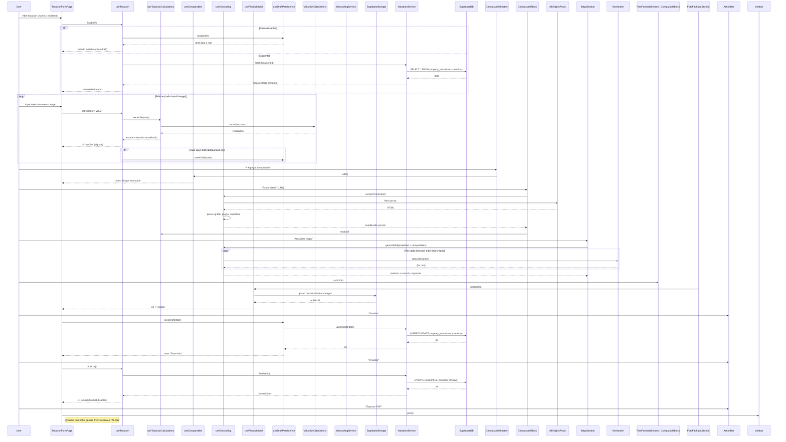

# ARQUITECTURA — Módulo Tasar (Fase 2)

**Fecha:** 2026-08-07
**Versión:** 1.0
**Basado en:** `audit.md` (Fase 1) + arquitectura Bienenhaus existente

---

## 1. COMPONENT TREE (Mermaid)

```mermaid
graph TD
    TasacionesPage[TasacionesPage] --> TasacionesList[TasacionesList]
    TasacionesPage --> TasacionFormPage[TasacionFormPage]
    
    TasacionesList --> useTasaciones[useTasaciones hook]
    TasacionesList --> TasacionRow[TasacionRow]
    TasacionesList --> ActionBar[ActionBar: Nueva, Filtros, Exportar]
    
    TasacionFormPage --> ActionBarForm[ActionBar: Guardar, Editar, Finalizar, PDF]
    TasacionFormPage --> DatosClienteSection[DatosClienteSection]
    TasacionFormPage --> FotoFachadaSection[FotoFachadaSection]
    TasacionFormPage --> DatosInmuebleSection[DatosInmuebleSection]
    TasacionFormPage --> MapaSection[MapaSection]
    TasacionFormPage --> DescripcionPropiedadSection[DescripcionPropiedadSection]
    TasacionFormPage --> ServiciosSection[ServiciosSection]
    TasacionFormPage --> BarrioSection[BarrioSection: Caracteristicas + Descripcion]
    TasacionFormPage --> ComparablesSection[ComparablesSection]
    TasacionFormPage --> AnalisisComparativoSection[AnalisisComparativoSection]
    TasacionFormPage --> ValuacionSection[ValuacionSection]
    TasacionFormPage --> ObservacionesSection[ObservacionesSection]
    TasacionFormPage --> PdfSection[PdfSection]
    
    ComparablesSection --> ComparableBlock[ComparableBlock] x N
    ComparableBlock --> PhotoUploader[PhotoUploader]
    ComparableBlock --> ExtractFromUrl[ExtractFromUrl btn]
    ComparableBlock --> CharacteristicsGrid[CharacteristicsGrid: 6 selects dinamicos]
    
    DescripcionPropiedadSection --> AmbienteGrid[AmbienteGrid: 18 inputs + Total]
    DescripcionPropiedadSection --> ComodidadesGrid[ComodidadesGrid: 3 selects]
    DescripcionPropiedadSection --> ServiciosBasicosGrid[ServiciosBasicosGrid: 3 selects]
    
    AnalisisComparativoSection --> ValuationChart[ValuationChart: Chart.js floating bars]
    AnalisisComparativoSection --> ComparablesTable[ComparablesTable: checkbox + rangos]
    
    MapaSection --> MapWrapper[MapWrapper: Leaflet + Nominatim]
    MapWrapper --> GeocodingService[GeocodingService: Nominatim + cache]
    
    ServiciosSection --> ServiciosGrid[ServiciosGrid: 6 selects RUBRO_NIVELES]
    
    BarrioSection --> CaracteristicasBarrioGrid[CaracteristicasBarrioGrid: 9 selects]
    BarrioSection --> DescripcionBarrioGrid[DescripcionBarrioGrid: 9 selects + % uso suelo]
    
    ValuacionSection --> ValorBoxes[ValorBoxes: 4 summary boxes]
    
    FotoFachadaSection --> PhotoUploader
    MapaSection --> MapWrapper
    
    PhotoUploader --> FileReader[FileReader API]
    ExtractFromUrl --> AllOriginsProxy[AllOrigins Proxy]
    MapWrapper --> Leaflet[Leaflet 1.9.4]
    MapWrapper --> Nominatim[Nominatim Geocoding]
    ValuationChart --> ChartJS[Chart.js 4.4.0]
    
    TasacionFormPage --> useTasacion[useTasacion hook]
    TasacionFormPage --> useTasacionCalculations[useTasacionCalculations hook]
    TasacionFormPage --> useComparables[useComparables hook]
    TasacionFormPage --> useGeocoding[useGeocoding hook]
    TasacionFormPage --> usePhotoUpload[usePhotoUpload hook]
    TasacionFormPage --> useDraftPersistence[useDraftPersistence hook]
    
    useTasacionCalculations --> ValuationCalculations[valuationCalculations.ts: 12 formulas puras]
    useGeocoding --> GeocodingService[geocodingService.ts: Nominatim + rate limit + cache]
    usePhotoUpload --> SupabaseStorage[Supabase Storage]
    useDraftPersistence --> ValuationService[valuationService.ts: Supabase CRUD]
    
    useTasacion --> ValuationSchemas[valuationSchemas.ts: Zod]
    ValuationCalculations --> ValuationSchemas
    ValuationService --> ValuationSchemas
```

---

## 2. DATA FLOW (Mermaid)



---

## 3. DECISIONES ARQUITECTURALES

| # | Decision | Justificacion |
|---|---|---|
| 1 | Zod como source of truth | Un solo lugar para validaciones, formularios, DB types, API contracts |
| 2 | Calculos puros en valuationCalculations.ts | Testables unitariamente, sin side effects, port 1:1 de TAI.html |
| 3 | TanStack Query + Signals | Server state (Query) + UI state (Signals) - patron Bienenhaus estandar |
| 4 | Supabase Storage para fotos | Base64 en localStorage no escala; CDN + signed URLs |
| 5 | GeocodingService con cache + rate limit | Nominatim 1req/s -> cache en Supabase (tabla geocode_cache) |
| 5 | Drafts en DB (no localStorage) | Persistencia cross-device, recuperacion, auditoria |
| 6 | Locked row en DB | finalized_at timestamp + locked boolean + RLS bloquea UPDATE |
| 7 | PDF via window.print() + @media print | Identico a TAI.html, zero dependencias extra |
| 8 | Componentes atomicos + composicion | Reutilizables, testables, sin archivo gigante |
| 9 | ExtractFromUrl como best-effort | Proxy CORS publico (allorigins) - puede fallar, UI lo maneja |
| 10 | Tipos derivados de Zod | z.infer<typeof schema> -> cero drift schema <-> tipo |

---

## 4. ESTRUCTURA DE ARCHIVOS (nuevos)

```
apps/admin/src/
├── schemas/
│   └── valuationSchemas.ts          # Zod schemas (source of truth)
├── types/
│   └── valuationTypes.ts            # Types inferidos + UI types
├── lib/
│   ├── valuationCalculations.ts     # 12 formulas puras + tests
│   ├── geocodingService.ts          # Nominatim + cache + rate limit
│   └── valuationService.ts          # Supabase CRUD + drafts + finalize
├── hooks/
│   ├── useTasaciones.ts             # List hook (TanStack Query)
│   ├── useTasacion.ts               # Form state + actions (signals)
│   ├── useTasacionCalculations.ts   # Recalc orchestrator
│   ├── useComparables.ts            # Comparables state + actions
│   ├── useGeocoding.ts              # Geocoding + extract
│   ├── usePhotoUpload.ts            # Supabase Storage upload
│   └── useDraftPersistence.ts       # Auto-save draft + load
├── components/
│   ├── tasaciones/
│   │   ├── TasacionesPage.tsx
│   │   ├── TasacionesList.tsx
│   │   ├── TasacionRow.tsx
│   │   ├── TasacionFormPage.tsx
│   │   ├── sections/
│   │   │   ├── DatosClienteSection.tsx
│   │   │   ├── FotoFachadaSection.tsx
│   │   │   ├── DatosInmuebleSection.tsx
│   │   │   ├── MapaSection.tsx
│   │   │   ├── DescripcionPropiedadSection.tsx
│   │   │   ├── ServiciosSection.tsx
│   │   │   ├── BarrioSection.tsx
│   │   │   ├── ComparablesSection.tsx
│   │   │   ├── AnalisisComparativoSection.tsx
│   │   │   ├── ValuacionSection.tsx
│   │   │   ├── ObservacionesSection.tsx
│   │   │   └── PdfSection.tsx
│   │   ├── shared/
│   │   │   ├── ComparableBlock.tsx
│   │   │   ├── PhotoUploader.tsx
│   │   │   ├── ExtractFromUrlButton.tsx
│   │   │   ├── CharacteristicsGrid.tsx
│   │   │   ├── AmbienteGrid.tsx
│   │   │   ├── ValorBox.tsx
│   │   │   ├── CoefBox.tsx
│   │   │   ├── ValuationChart.tsx
│   │   │   ├── MapWrapper.tsx
│   │   │   └── ActionBar.tsx
│   │   └── index.ts
├── pages/
│   └── TasacionesPage.tsx           # Entry point (lazy loaded en App.tsx)
└── supabase/
    └── migrations/
        └── 004X_valuation.sql       # DB schema
```

---

## 5. ESQUEMA DB (Migracion 004X_valuation)

```sql
-- property_valuations (tabla principal)
create table public.property_valuations (
  id uuid primary key default gen_random_uuid(),
  -- Datos cliente
  solicitante text not null,
  fecha date not null,
  telefono text,
  destino text not null check (destino in ('Venta','Alquiler')),
  -- Foto fachada
  foto_fachada_url text,
  -- Datos inmueble
  direccion text not null,
  barrio text,
  localidad text,
  provincia text,
  sup_terreno numeric,
  sup_construida numeric,
  tipo text not null check (tipo in ('CASA','DEPTO','LOTE','GALPON','OFICINA','LOCAL','OTRO')),
  precio_dolar numeric,
  valor_uva numeric,
  -- Descripcion propiedad
  tipo_construccion text,
  espacio_habitable numeric,
  plantas numeric,
  anio_construccion numeric,
  imp_inmobiliarios numeric,
  tipo_techo text,
  orientacion text,
  luminosidad text,
  calidad_constructiva text,
  calidad_mantenimiento text,
  detalles_terminacion text,
  estacionamiento_tipo text,
  -- Ambientes (18 campos)
  amb_cocina numeric default 0,
  amb_dormitorios numeric default 0,
  amb_terraza numeric default 0,
  amb_comedor numeric default 0,
  amb_suite numeric default 0,
  amb_patio numeric default 0,
  amb_cocina_comedor numeric default 0,
  amb_suite_vestidor numeric default 0,
  amb_balcon numeric default 0,
  amb_living numeric default 0,
  amb_dormit_vestidor numeric default 0,
  amb_lavadero numeric default 0,
  amb_living_comedor numeric default 0,
  amb_bano_servicio numeric default 0,
  amb_cuarto_guardado numeric default 0,
  amb_escritorio numeric default 0,
  amb_bano numeric default 0,
  amb_garage numeric default 0,
  amb_total_cuartos numeric generated always as (
    amb_cocina + amb_dormitorios + amb_terraza + amb_comedor + amb_suite + amb_patio +
    amb_cocina_comedor + amb_suite_vestidor + amb_balcon + amb_living + amb_dormit_vestidor +
    amb_lavadero + amb_living_comedor + amb_bano_servicio + amb_cuarto_guardado +
    amb_escritorio + amb_bano + amb_garage
  ) stored,
  -- Comodidades
  com_doble_circulacion text,
  com_asador text,
  com_piscina text,
  -- Servicios basicos
  calefaccion text,
  aire_acondicionado text,
  agua_caliente text,
  -- Adversas
  caracteristicas_adversas text,
  -- Servicios (6 rubros)
  serv_electricidad text,
  serv_gas text,
  serv_internet text,
  serv_agua text,
  serv_cloaca text,
  serv_techos text,
  -- Barrio
  tipologias_edilicias text,
  calidad_constructiva_predom text,
  construccion_altura_prevalencia text,
  uso_comercial_prevalencia text,
  uso_industrial_prevalencia text,
  nivel_socioeconomico_barrio text,
  barrio_tipo text,
  construido_pct text,
  indice_crecimiento text,
  serv_vigilancia text,
  tendencia_valores text,
  demanda_oferta text,
  tiempo_comercializacion text,
  cambios_uso_terreno text,
  facilidades_estacionamiento text,
  uso_residencial numeric,
  uso_comercial numeric,
  uso_industrial numeric,
  uso_otro numeric generated always as (greatest(0, 100 - coalesce(uso_residencial,0) - coalesce(uso_comercial,0) - coalesce(uso_industrial,0))) stored,
  -- Valuacion
  v_terreno_precio numeric,
  -- Estado
  locked boolean default false,
  finalized_at timestamptz,
  -- Auditoria estandar
  created_at timestamptz default now(),
  updated_at timestamptz default now(),
  deleted_at timestamptz,
  created_by uuid references auth.users(id),
  updated_by uuid references auth.users(id)
);

-- valuation_comparables
create table public.valuation_comparables (
  id uuid primary key default gen_random_uuid(),
  valuation_id uuid not null references public.property_valuations(id) on delete cascade,
  orden int not null,
  direccion text,
  barrio text,
  precio numeric,
  sup_terreno numeric,
  sup_cubierta numeric,
  dias numeric,
  tipo_construccion text,
  antiguedad numeric,
  foto_url text,
  url_origen text,
  chars jsonb not null default '[]'::jsonb, -- array de 6 strings (NIVELES)
  included boolean default true,
  created_at timestamptz default now(),
  updated_at timestamptz default now()
);

-- valuation_images (fotos fachada + comparables unificadas)
create table public.valuation_images (
  id uuid primary key default gen_random_uuid(),
  valuation_id uuid not null references public.property_valuations(id) on delete cascade,
  comparable_id uuid references public.valuation_comparables(id) on delete set null, -- null = fachada
  url text not null,
  tipo text not null check (tipo in ('fachada','comparable')),
  orden int default 0,
  created_at timestamptz default now()
);

-- valuation_history (auditoria automatica via trigger)
create table public.valuation_history (
  id uuid primary key default gen_random_uuid(),
  valuation_id uuid not null references public.property_valuations(id) on delete cascade,
  action text not null,
  old_data jsonb,
  new_data jsonb,
  changed_by uuid references auth.users(id),
  created_at timestamptz default now()
);

-- RLS policies (staff CRUD, owner read, etc.)
alter table public.property_valuations enable row level security;
create policy valuation_staff_all on public.property_valuations for all using (public.is_staff());
create policy valuation_owner_read on public.property_valuations for select using (created_by = auth.uid());

-- Triggers: updated_at, audit_history, sync_comparables_count, etc.
```

---

## 6. ZOD SCHEMAS — ESTRUCTURA (valuationSchemas.ts)

```typescript
// valuationSchemas.ts — SOLO ESTRUCTURA, implementacion completa en Fase 3

// Enums (match DB + TAI.html exacto)
export const TipoInmuebleEnum = z.enum(['CASA','DEPTO','LOTE','GALPON','OFICINA','LOCAL','OTRO']);
export const DestinoEnum = z.enum(['Venta','Alquiler']);
export const NivelCalidadEnum = z.enum(['','Excelente','Buena','Media','Regular','Mala','N/A']);
export const NivelLuminosidadEnum = z.enum(['','Malo','Regular','Promedio','Buena','Excelente','N/A']);
export const OrientacionEnum = z.enum(['','Norte','Sur','Este','Oeste','Noreste','Sudeste','Noroeste','Sudoeste','N/A']);
export const TipoConstruccionEnum = z.enum(['','Ladrillo','Metalica','Madera','Bloques de hormigon','N/A']);
export const TipoTechoEnum = z.enum(['','N/A','Losa H°A°','Losa ceramica','Tejas s/ estr. Madera','Pizarra s/ estr. Madera','Chapa s/ estr. Madera','Chapa s/ estr. Metalica']);
export const EstacionamientoEnum = z.enum(['','Garaje cubierto','Garaje semicubierto','Garaje descubierto','N/A']);
export const SiNoNAEnum = z.enum(['','Si','No','N/A']);
export const ServicioNivelEnum = z.enum(['Central','Individual','Inexistente','N/A']);
export const RubroNivelEnum = z.enum([
  'Optimo / Impecable (Listo para Habitar)',
  'Sencilla (Cosmetica / Menor)',
  'Moderada (Parcial / Funcional)',
  'Grave (Deterioro Estructural)',
  'A Nuevo (Redisenio Total)'
]);
export const TipologiaEdiliciaEnum = z.enum(['','Construccion en altura','Construccion de media altura','Viviendas unifamiliares y PH de hasta tres plantas','Viviendas unifamiliares y PH de una planta','Casas quinta','Industrias de gran envergadura','Industrias de pequena y mediana envergadura']);
export const CalidadPredomEnum = z.enum(['','Excelente','Muy Buena','Buena','Media','Economica','Precaria']);
export const PrevalenciaEnum = z.enum(['','En todo el entorno','Sobre arterias principales','Ocasional','No relevante o inexistente']);
export const NivelSocioEnum = z.enum(['','Alto','Medio alto','Medio','Medio Bajo','Bajo']);
export const BarrioTipoEnum = z.enum(['','Urbano','Suburbano','Rural']);
export const ConstruidoPctEnum = z.enum(['','Mas del 75%','Entre el 75% y el 25%','Menos del 25%']);
export const IndiceCrecimientoEnum = z.enum(['','Estable','Creciente','Decreciente']);
export const VigilanciaEnum = z.enum(['','Si','No']);
export const TendenciaValoresEnum = z.enum(['','Creciente','Estable','Decreciente']);
export const DemandaOfertaEnum = z.enum(['','Exceso de Oferta','Falta de Oferta','Relacion Oferta/Demanda Equilibrada']);
export const TiempoComercializacionEnum = z.enum(['','Menos de 3 meses','Entre 3 y 6 meses','Mas de 6 meses']);
export const CambiosUsoEnum = z.enum(['','Probable','Improbable','En Proceso']);
export const FacilidadesEstacionamientoEnum = z.enum(['','Garage Propio','Garajes privados','En la via publica']);
export const NivelesComparacionEnum = z.enum(['Mucho Mejor','Mejor','Igual','Peor','Mucho Peor']);

// Constantes PESOS + SLOT_ORDER (port exacto de TAI.html)
export const PESOS = { /* ... */ } as const;
export const SLOT_ORDER = [3,2,5,0,4,1] as const;
export const NIVELES = { /* ... */ } as const;
export const RUBROS = { /* ... */ } as const;

// Schemas principales
export const ComparableSchema = z.object({ /* 15 campos + chars[6] */ });
export const ValuacionInputSchema = z.object({ /* 120+ campos */ });
export const ValuacionDraftSchema = ValuacionInputSchema.extend({ /* metadata */ });
export const ValuacionDBValuacionSchema = ValuacionInputSchema.extend({ /* id, timestamps, locked, etc */ });
```

---

## 7. PROXIMOS PASOS (Fase 3)

1. **Implementar `valuationSchemas.ts` completo** (Zod + types inferidos)
2. **Implementar `valuationCalculations.ts`** (12 formulas puras + tests unitarios)
3. **Migracion SQL** -> `supabase db push` local + cloud
4. **`valuationService.ts`** (CRUD + drafts + finalize)
5. **Hooks** (`useTasacion`, `useTasacionCalculations`, `useComparables`, `useGeocoding`, `usePhotoUpload`, `useDraftPersistence`)
6. **Componentes UI** (seccion por seccion, bottom-up)
7. **Integracion router/sidebar/permisos**
8. **Tests** (unit: formulas; E2E: crear tasacion completa -> PDF -> comparar valores)
9. **QA side-by-side vs TAI.html**

---

**Fase 2 COMPLETA** — Especificaciones listas para implementacion.